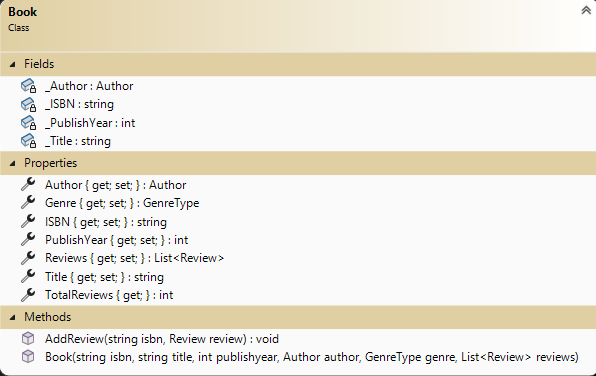

# OOP Training

> This is the next of a set of exercises that follow the evolution of a program to manage Books. This set is cumulative and will build upon previous exercises.

## Overview

Your task is to generate a set of simple data types to represent the primary objects for managing Books.

For this exercise, place all the required property data types in the namespace `BookSystem` and ensure that they are `public`. Use your **class library** (.NET Core 8) from Exercse 1. You will be required create a xUnit Tests project that will contain unit tests to inform you if your work will meet specifications. **Ensure you follow the given class diagrams for the Unit Tests to work.**

### General Validation Rules

All validation is to be performed by throwing exceptions. Here are some general requirements.

- Exceptions must have meaningful error messages with keywords (ex: positive, minimum).
- Use `ArgumentException()` for parameter value errors.
- Error messages must include details about the limits for acceptable values.
- Year must always be positive and non-zero whole numbers (eg: 2020).
- All string information must contain text. Null, empty, and plain white-space text is not allowed. Sanitize your strings by trimming the leading and trailing whitespace.

### The `GenreType`

Clasification recommendation for the book. 

### The `Book` **Coding required**

A Book is related to a single author. A Book is assigned a unique industry ISBN. The Genre is from a enum list. A Book may have many reviews. An author may send books to individuals for review before the book is actual published to assist in promotion. A reviewer can only give one review for the book. The Book will track:

- **ISBN** - This identifies the Book. Cannot not be null.
- **Title** - This is the title of the Book. Cannot not be null.
- **PublishYear** - This is the year the Book was published. Required format yyyy.
- **Author** - This is the author of the Book. Required.
- **Genre** - This is the Genre type category the Book to which the book has been assigned. (auto-implement)
- **Reviews** - This is a list of all reviews for the Book. This list can be empty as the book is published or may have reviews from individuals given access to a pre-published copy of the book. A reviewer may only have one review per book. (auto-implement property)
- **TotalReviews** - Returns the number of reviews for this book in the List&lt;Review&gt; collection.

## Create Unit testing methods

 Create a unit testing project (.Net Core 8.0) called `BooksUnitTestsEx2` for this exercise. Add it to your solution. Create a class called `Book_Should` to hold your unit test code. Add a reference of your BookSystem project to this project. The following table indicates the unit test cases to create. Unit Test names are left up to you. The required tests are outlined in the following table. You are to use NuGet FluentAssertions package within the xUnit testing project. **Group your unit tests within regions by Class item.**

#### Unit Tests

 | Class item | Success/Fail | Specifications |
| ---- | --------- | ------------------- |
| Book  | Success | A book was successfully created with no Review collection.   |
| Book  | Success | A book was successfully created with with a Review collection. (At least 3 reviews in collection)  |
| Book  | Fail | There are missing values (ISBN, Title and Author) for required data class members. Use ArgumentNullExpection().   |
| PublishYear  | Success | Able to change the publication year.  |
| PublishYear  | Fail | The publication year is not a value year format. Use FormatExpection().   |
| AddReveiw  | Success | Adds first Reveiw to the Book. A reviewer can only submit as single review. Review must be for book. |
| AddReveiw  | Success | Adds another Reveiw to the Book. Assume the list has an unknown number of reviews (at least one). A reviewer can only submit as single review. Review must be for book. |
| AddReview  | Fail | There is no isbn supplied. Use ArgumentNullExpection(). Message must contain `ISBN required`. Your assert must check the message.   |
| AddReview  | Fail | There is no review instance supplied. Use ArgumentNullExpection(). Message must contain `Review required`. Your assert must check the message.   |
| AddReveiw  | Fail | Adding a review where review ISBN does not match the Book ISBN. Use ArgumentExpection(). Include review ISBN in the exception message and check for it within the assert.| 
| AddReveiw  | Fail | Adding a review where reviewer already has submitted a review. Use ArgumentExpection(). Include reviewer full name in the exception message and check for it within the assert.|   

----

## Evaluation

> ***NOTE:** Your code **must** compile. Solutions that do not compile will receive an automatic mark of zero (0).*
> 
> If you are unable to get a portion of the assignment to compile or work, you should:
> - Comment out the  portion of code
> - Identify the reason for the commented portion (such *as does not compile* or *does not work cause an abort*)
>
> Other concerns (Examples but not linited to:)
> - commits do not reflect incremental development;
> - unstructure code;
> - other instuctor requirements;
> - class standards;

Your assignment will be marked based upon the following weights. See the [general rubric](../README.md) for details.

| Earned | Weight | Deliverable/Requirement | Comments |
| ---- | ----- | --------- | ------- |
|  | 5 | Book |   |
|  | 5 | xUnit Testing |   |
| ---- | ----- | --------- | ------- |
|  | **10** | **Total ** |    |

----
[Return to exercises](../README.md)
