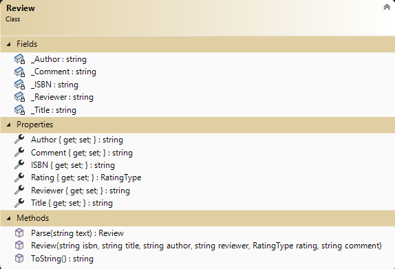
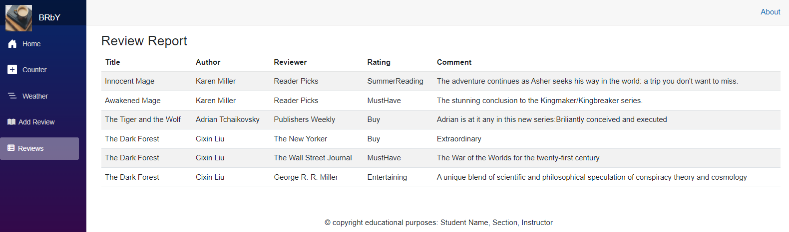
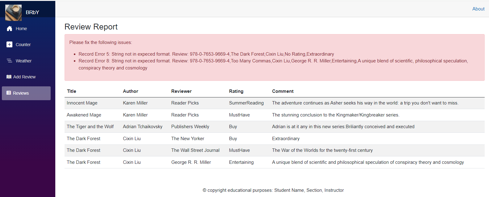
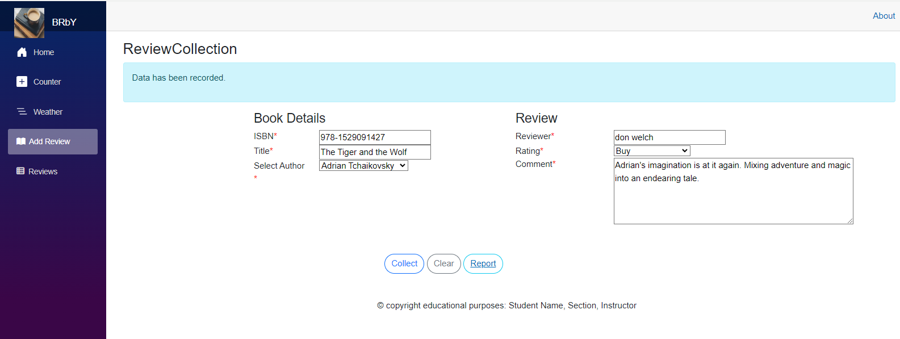
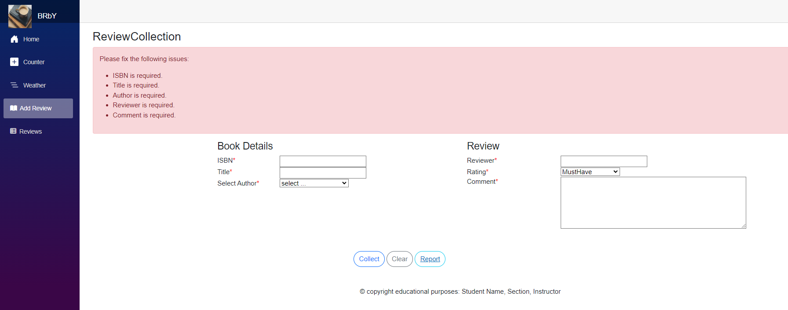

# CPSC1517-1241 Exercise 3

> This exercise is part of a series of exercises to manage information on a collection of book reviews. In this exercise you will create a Blazor web application project. BookReview is a site to keep up-to-date with your book reviews.
>
> **This set is cumulative** future exercises in this series will build upon previous exercises.

## Objective

Upon completion of this exercise, you will have demonstrated the ability to:

- use an existing class library of data models in a web application
- implement a data entry component with input validation
- implement a tabular report component displaying a collection of data
- use a CSV file for data persistence (append data, read and display)

----

## Project/Solution Setup

You are to create a new ASP.NET Core **Blazor** Web Application project within a new solution for this exercise. Create the project for .Net Core 8 and give your project the name **`BookWebApp`**. Check with your instructor about specific settings/customizations for your Blazor project. Copy the supplied class library into your new solution.

To ensure that your web application works, build and run your project. A browser window should open in a local hosted port.(Example https://localhost:5001 , your port may be different).

The styling for your application is up to you. The default template for the `web app` project uses Bootstrap built in, but you can use any website styling you choose. (**Note:** Your instructor may offer specific guidance/restrictions with regard to styling.)

### Reference Your Existing Class Library

For your web application, add a project reference to the **supplied** `BookSystem` class library so that you can use its classes in your application. You will be making use of the `Author`, `Review` and `RatingType` types. The Author class will return a list of authors for use in your solution.

### Alter the Review class

Add a method called **Parse** to the Review class. This method will receive a string. The method will return an instance of Review. The method will validate that the string contains the values to create an instance of Review. If the string is not in the proper format, throw a FormatException error with the string as part of the message.



### Add a `Data` Folder

Add a folder to your web application project and give it the name `Data`. You will need to place your CSV file into this folder. Create a text file called `TestData.csv` within this folder. In this file, you will need to enter the following sample CSV content as your initial set of good data. You will need to create a second test file that contains **both** good and bad data.

```csv
978-0-316-06780-5,Innocent Mage,Karen Miller,Reader Picks,SummerReading,The adventure continues as Asher seeks his way in the world: a trip you don't want to miss.
978-0-316-06781-2,Awakened Mage,Karen Miller,Reader Picks,MustHave,The stunning conclusion to the Kingmaker/Kingbreaker series.
978-1529091427,The Tiger and the Wolf,Adrian Tchaikovsky,Publishers Weekly,Buy,Adrian is at it any in this new series:Briliantly conceived and executed
978-0-7653-9669-4,The Dark Forest,Cixin Liu,The New Yorker,Buy,Extraordinary
978-0-7653-9669-4,The Dark Forest,Cixin Liu,The Wall Street Journal,MustHave,The War of the Worlds for the twenty-first century
978-0-7653-9669-4,The Dark Forest,Cixin Liu,George R. R. Miller,Entertaining,A unique blend of scientific and philosophical speculation of conspiracy theory and cosmology
```

----

## Web Application Content

### Modify the Main Layout

Modify the main layout component to include your name, section number, and instructor's name as a `<footer>` on your website. This needs to be part of the main layout so that it appears on every page within the website. Modify the About href to point to your own About page. Do not have it go to a new page.

### Update the Website Navigation

Add links for the following pages in your website's navigation. (Leave the current default links on the menu; you are simply adding to the existing navigation.)

- **`/ReviewCollection`** with the link text "Reviews"
- **`/ReviewReport`** with the link text "Report"
- **`/About`** with the link text "About".

Create your own (or find an existing) image that you wish to use as a brand image (*logo*) for your navigation menu. If you are using an image that someone else created, make sure that you give credit to the individual on your `About` page.

> ***Tip:** Create placeholder pages for the new navigation links. You will need to modify the content of those pages as noted later in these specifications. Ensure each page has an appropriate page title (i.e.: the title in your browser tab) for its content.*

### Modify the Home Page

Modify the home page to include the following.

- The page title (i.e.: the title in your browser tab) for the site must be **`Book Reviews`**.
- A header (`<h1>` tag) with the content: `Book Reviews`.
- An image (e.g.: a larger version of your site's logo or some other image) as a "Hero" image for the site. Ensure the hero section of your site does not exceed 700 px in height/width.
- One to two paragraphs offering a welcome message and summary description of the site (use your own wording).

### The `/About` Page

In your `About.razor` component include the text `Exercise 3 - May 2024` in an `<h1>` tag. Following that, include this content (each with an appropriate `<h2>` header):

- **`Author: Your_name`** with your full name replacing the *`Your_name`* portion
- **`Section: X##`** with the *`X##`* being your section number (e.g.: `E01`)
- **`Instructor: Some Body`** with your instructor's name (i.e.: replace *`Some Body`* with the appropriate name)
- **`Known Bugs:`** After this heading, include an un-ordered list of known bugs (items that are non-functional or incomplete) with respect to the requirements for this exercise.

### The `/ReviewReport` Page

In your `ReviewReport.razor` component, you are to display the records of book reviews as read from the CSV file created earlier. Read the content into a collection of `Review` objects and display the collection on the page in a tabular format (refer to the mockup image below). Remember to display an appropriate message if the collection is empty and offer a loading message while the data is being retrieved.





### The `/ReviewCollection` Page

In your `ReviewCollection.razor` component, you are to provide the user the ability to add reviews. Your page will need to append the user's input to your existing CSV file. The user's input is to be validated according to the internal behaviour of your `Review` class (i.e.: you will need to catch any exceptions when instantiating `Review` objects and display appropriate feedback to the user). When appending to the CSV file, use the `.ToString()` method of your `Review` class to represent the data.

A mockup image of the required component is supplied. Your component does not need to have the same layout **but** must use the same variety of controls as the mockup for the page content. The following buttons should be included in your form.

- **Record** will validate the incoming data and save to the CSV file if correct.
- **Clear** will reset the fields to empty input state.
- **Go to Report** will transfer the user to the review Report page.

To provide guidance to the user during input, ensure your component includes the following.

- Indicate required fields with an asterisk - `*`
- Select the author from the list supplied in the Author class.



Be sure to validate the incoming data and display any errors as a single summary with a list of specific problems; each individual error must have a unique message so that the user knows exactly what input is incorrect (i.e.: do not generalize your error messages).

- ensure the ISBN is present with data.
- ensure the Title is present with data.
- ensure the Author name is present with data.
- ensure the Reviewer name is present with data.
- ensure a Comment is present with data.



----

## Evaluation

> ***NOTE:** Your code **must** compile. Solutions that do not compile will receive an automatic mark of zero (0).*
> 
> If you are unable to get a portion of the assignment to compile or work, you should:
> 
> - Comment out the  portion of code
> - Identify the reason for the commented portion (such *as does not compile* or *does not work cause an abort*)
>
> Other concerns (Examples but not linited to:)
> - commits do not reflect incremental development;
> - unstructure code;
> - other instuctor requirements;
> - class standards;

Your assignment will be marked based upon the following weights. See the [general rubric](../README.md) for details.


| Earned | Weight | Deliverable/Requirement | Comment |
| :----: | :----: | ----------------------- | ------------- |
|        |  1     | Inclusion of supplied class library - Author |    |
|        |  1     | Site Layout |    |
|        |  1     | Site Navigation |    |
|        |  1     | Home Page |    |
|        |  1     | "About" page |    |
|        |  3     | `ReviewReport` component |   |
|        | 6     | `ReviewCollection` component |   |
| ------ | ------ | --------- |  ------ |
|        | **13** | **Total Weight** | ------ |

----

[Return to exercises](../README.md)
